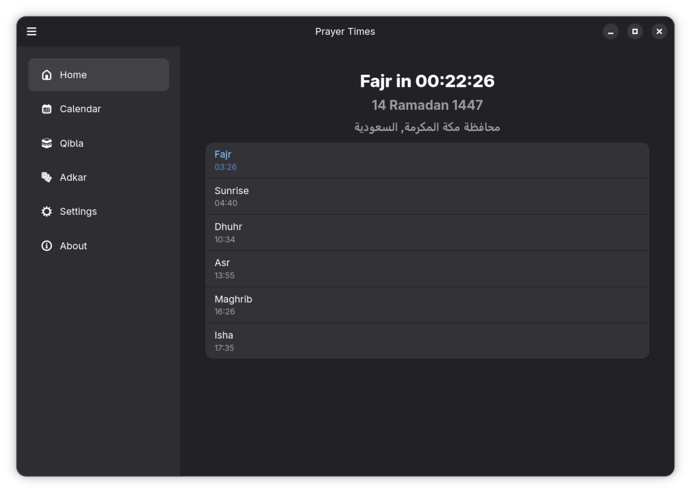
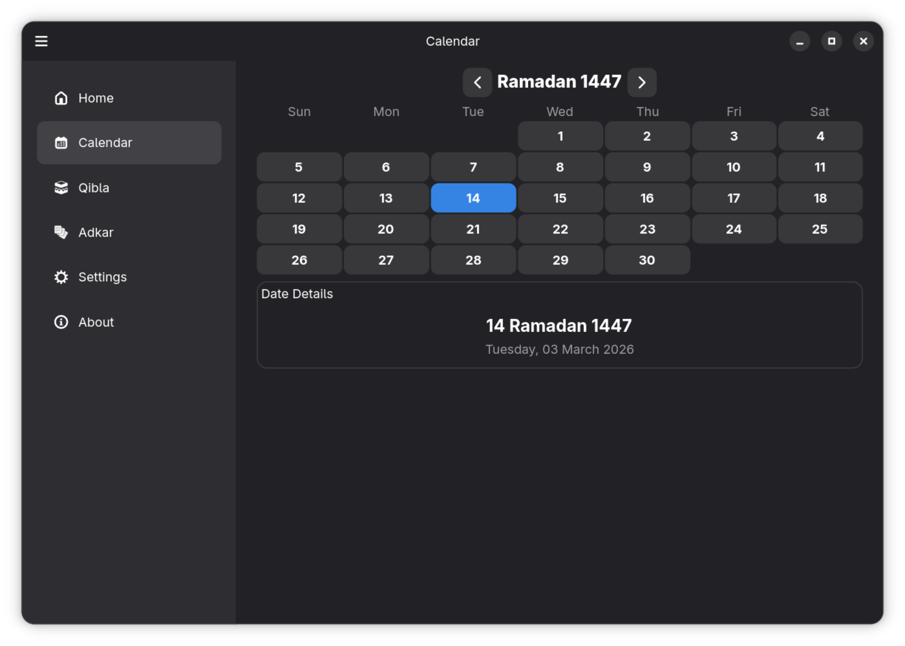
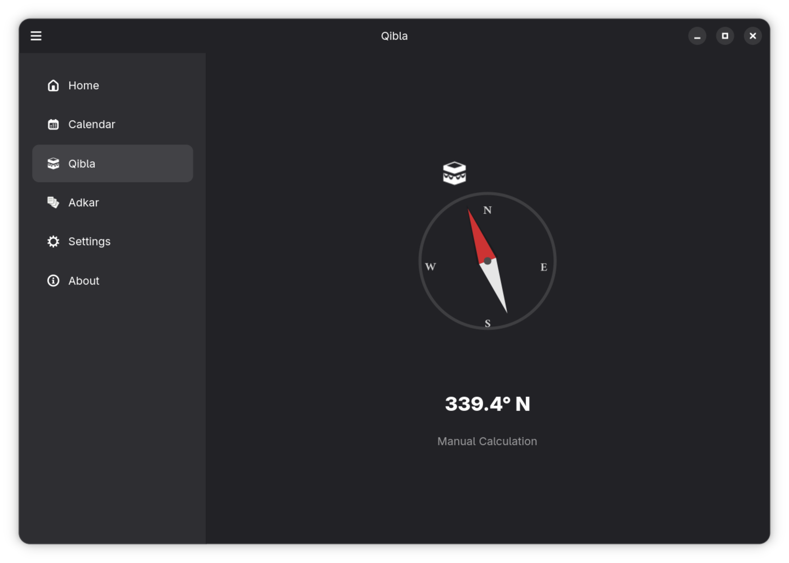
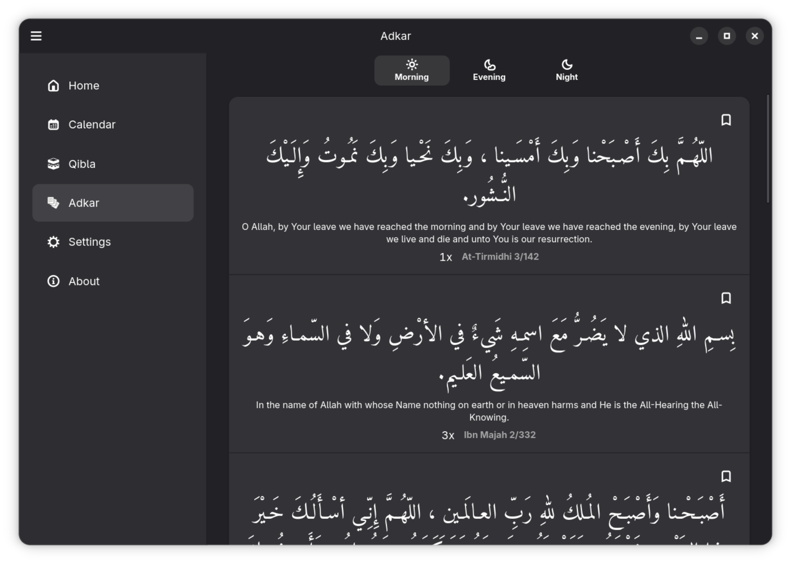
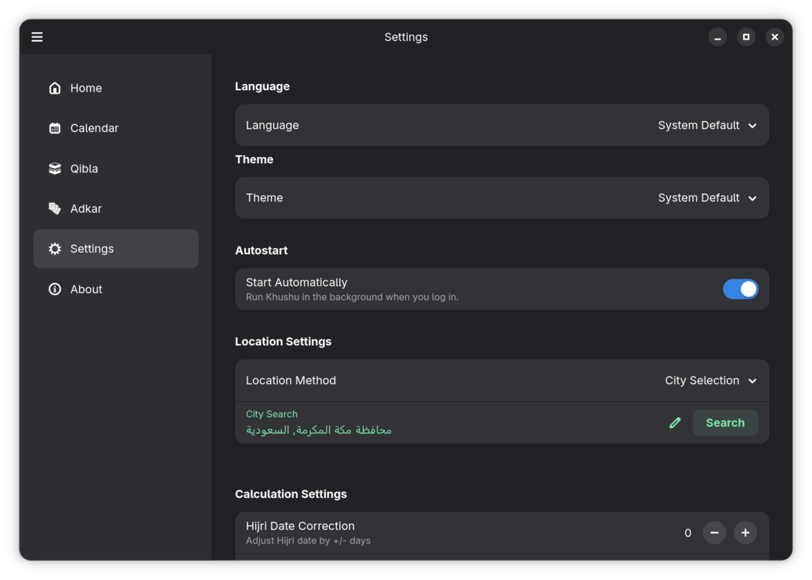
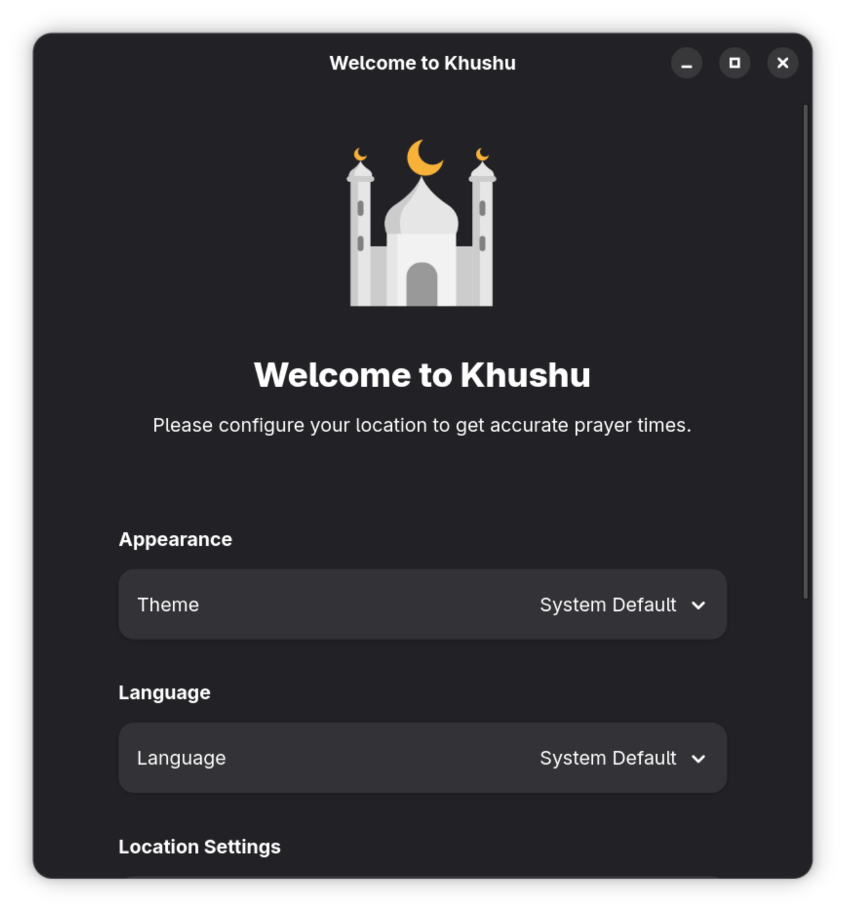

<div align="center">

  
  <h1>Khushu (خشوع)</h1>

  [](https://www.rust-lang.org/)
  [](https://gtk.org/)
  [](https://gnome.pages.gitlab.gnome.org/libadwaita/)
  [](#)
  [](LICENSE)
  [](#)

</div>

**Khushu is your all-in-one Muslim app for Linux desktop, tablets, and smartphones.**

Named after the state of heart-presence and humility in prayer (Salah), the app is designed to help you disconnect from digital noise and reconnect with your Creator. It brings together accurate prayer times and native Adkar notifications in a clean, modern interface—built with zero telemetry and total respect for your data.

## Screenshots

<div align="center">
<table>
  <tr>
    <td align="center"><br/><sub>Prayer Times Dashboard</sub></td>
    <td align="center"><br/><sub>Hijri Calendar</sub></td>
  </tr>
  <tr>
    <td align="center"><br/><sub>Qibla Compass</sub></td>
    <td align="center"><br/><sub>Adkar</sub></td>
  </tr>
  <tr>
    <td align="center"><br/><sub>Settings</sub></td>
    <td align="center"><br/><sub>Welcome & Setup</sub></td>
  </tr>
</table>
</div>

## Features

- **Accurate Prayer (Salah) Times**: Calculations based on standard calculation methods (MWL, ISNA, Egypt, etc.).
- **Privacy-First Location**:
    - **Manual**: Enter coordinates manually (Zero network usage).
    - **City Search**: Search via OpenStreetMap (Minimal data).
    - **Auto**: System location via GeoClue (no IP-based lookup; data stays on device).
- **Adhan & Notifications**:
    - Play Adhan sound at prayer times.
    - **Audio Presets**: Select from bundled sounds or use your own custom MP3.
    - **Pre-Prayer Alerts**: Get notified before the prayer starts.
    - **System Integration**: Native desktop notifications.
- **Adkar**: Built-in Morning and Evening Adkar module.
- **Hijri Calendar**: Current Hijri date displayed on dashboard.
- **Secure Configuration**: Your sensitive settings (like latitude/longitude) are encrypted locally using XOR obfuscation and Base64 encoding.
- **Modern UI**: Native Libadwaita interface with adaptive dark mode and system tray integration.

## What's Next? (Roadmap)

Khushu is under active development. Our goal is to build the premier all-in-one Islamic ecosystem for Linux.

- **The Holy Quran & Travel (v1.1.0)**: We want to build a truly beautiful, offline-first Quran reader with sharp typography and a search function that feels fast and useful. We also plan to add a **timezone override** setting for travelers whose system clock may not match their physical location.
- **Islamic Essentials (v1.2.0)**: We are working on a few more tools, including a simple Zakat calculator, a way to reflect on the 99 Names of Allah, and a collection of the Forty Hadith of Nawawi.
- **Beyond the Desktop (v2.0.0)**: We want Khushu to be wherever you are. This means perfecting the experience for Linux mobile (Phosh/Plasma) and exploring an Android version by leveraging the same core logic we already built.

## Installation

### Recommended Methods

| Format | Command / Action |
| :--- | :--- |
| **Flatpak (Flathub)** | `flatpak install flathub com.github.sniper1720.khushu` |
| **Snap (Snap Store)** | `sudo snap install khushu` |
| **Arch Linux (AUR)** | `yay -S khushu` |

### Binary Packages
Pre-compiled **.deb** and **.rpm** binaries are available on the [GitHub Releases](https://github.com/sniper1720/khushu/releases) page for manual installation on Debian, Ubuntu, Fedora, and openSUSE.

---

### Build from Source

If you prefer to compile Khushu manually, you must first install the required system dependencies and the Rust toolchain.

#### 1. System Dependencies

| Distribution | Installation Command |
| :--- | :--- |
| **Debian / Ubuntu** | `sudo apt install libgtk-4-dev libadwaita-1-dev libasound2-dev libssl-dev build-essential pkg-config gettext` |
| **Fedora** | `sudo dnf install gtk4-devel libadwaita-devel alsa-lib-devel openssl-devel gcc pkgconf-pkg-config gettext` |
| **Arch Linux** | `sudo pacman -S gtk4 libadwaita alsa-lib openssl base-devel gettext` |
| **openSUSE** | `sudo zypper install gtk4-devel libadwaita-devel alsa-lib-devel openssl-devel gcc pkg-config gettext` |

#### 2. Rust Toolchain
Install the latest stable Rust toolchain (2024 Edition support required):
```bash
curl --proto '=https' --tlsv1.2 -sSf https://sh.rustup.rs | sh
```
*Note: After installation, restart your terminal or run `source $HOME/.cargo/env`.*

#### 3. Compile and Run
```bash
git clone https://github.com/sniper1720/khushu.git
cd khushu
cargo run --release
```

## Configuration

Khushu stores its configuration in a localized JSON file at `~/.config/khushu/config.json`. This file manages all your personal preferences, including:

- **Location Settings**: Whether you use manual coordinates, city search, or auto-detection.
- **Prayer Calculation**: Your preferred calculation method, madhab (Asr shadow factor), and custom offsets.
- **Notifications**: Adhan sound selections, pre-prayer alert timings, and Adkar notification toggles.
- **Volume & Audio**: Output device settings and volume levels for both Adhan and Adkar alerts.

For your privacy, sensitive fields such as your latitude and longitude are **encrypted** before being written to disk, ensuring that your precise location remains protected even if the file is accessed. While you can modify this file manually, it is recommended to use the built-in **Settings** menu within the application to ensure all changes are validated and correctly saved.

## Privacy & Data Use

Khushu is designed with privacy as a core principle. Here is exactly what data leaves your device and when:

| Service | When Used | Data Sent | Purpose |
|---------|-----------|-----------|---------|
| **GeoClue** (D-Bus) | "Auto" location mode only | None — queries the system location service locally | Obtains GPS/network-based coordinates without any external request |
| **OpenStreetMap Nominatim** | "City Search" and "Auto" modes | City name or coordinates | Resolves city names to coordinates (City Search) or coordinates to city names (Auto reverse geocode); subject to [OSM privacy policy](https://wiki.osmfoundation.org/wiki/Privacy_Policy) |
| **None** | "Manual" mode | Nothing | You enter coordinates yourself — zero network traffic |

**Local storage:** Your latitude and longitude are encrypted (XOR obfuscation + Base64) before being saved to `~/.config/khushu/config.json`. They are never transmitted to any server by the app itself.

**No analytics, no telemetry, no accounts.** All prayer calculations, Adkar, Hijri dates, and Qibla bearing are computed locally on your device.

## Flatpak Permissions
When installed via Flatpak, Khushu requests the following permissions to function correctly within the sandbox:
* **Network (`--share=network`)**: Required for the "City Search" feature (OpenStreetMap Nominatim API).
* **Location (`org.freedesktop.GeoClue2`)**: Required for the "Auto Detection" location mode.
* **Notifications (`org.freedesktop.Notifications`)**: Required to send system alerts when it's time to pray.
* **Audio (`--filesystem=xdg-run/pipewire-0:ro`)**: Required to play the Adhan sound via PipeWire.
* **System Tray (`org.kde.StatusNotifierWatcher`)**: Required to display the background tray icon.
* **Graphics & IPC (`wayland`, `fallback-x11`, `dri`, `ipc`)**: Standard permissions required by GTK4/libadwaita for display and hardware acceleration.

## License

This project is licensed under the **GNU General Public License v3.0 or later**. See [LICENSE](LICENSE) for details.
