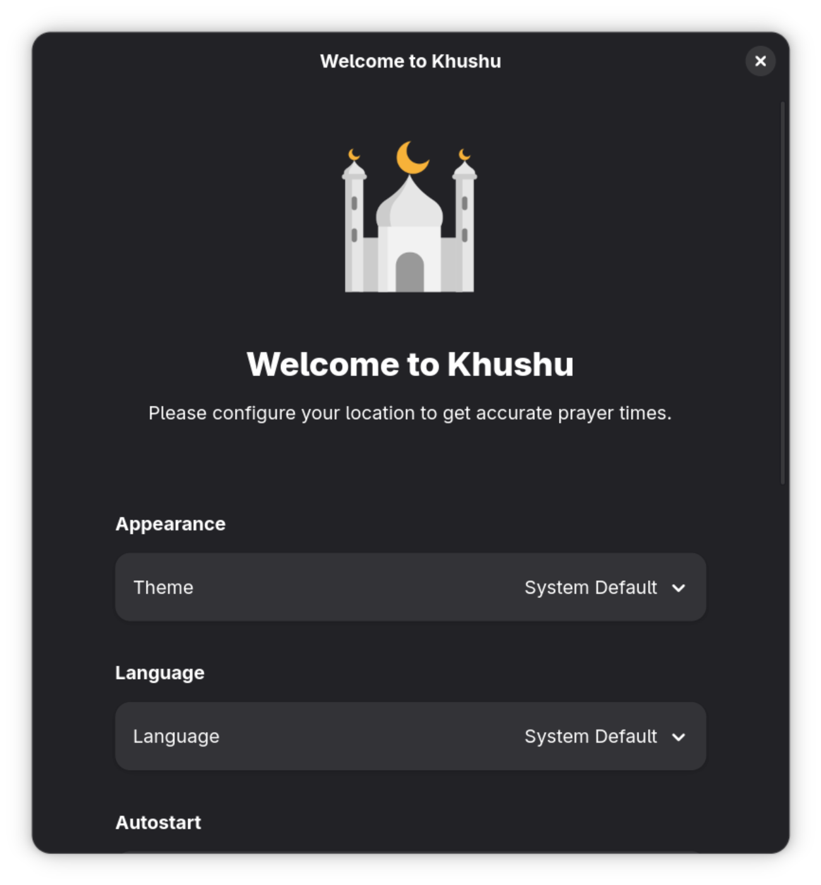
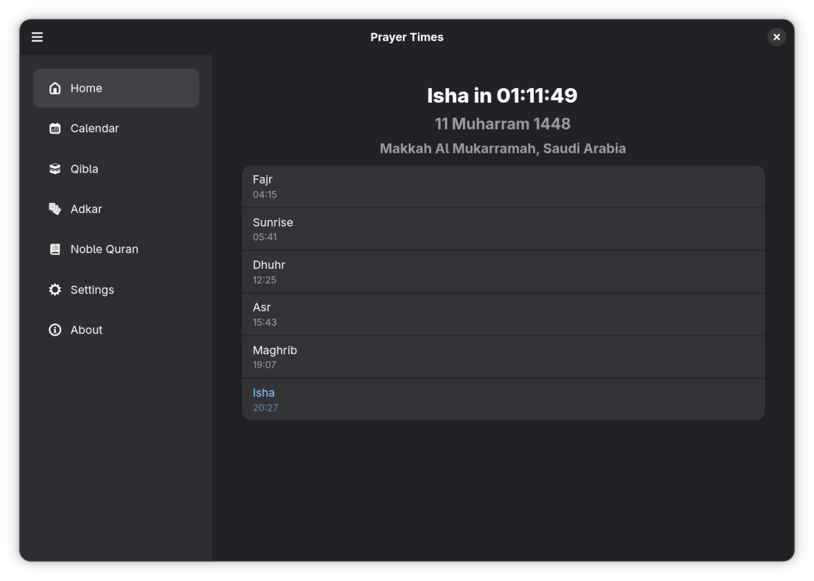
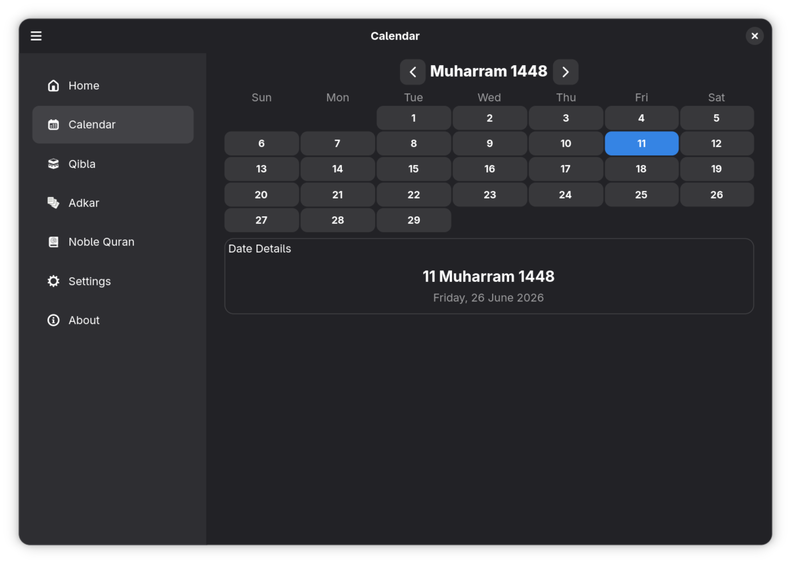
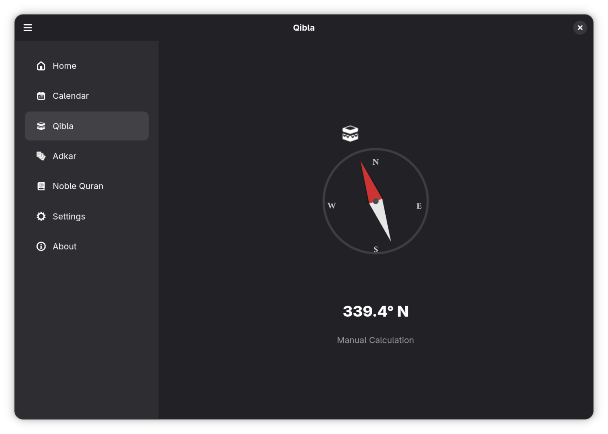
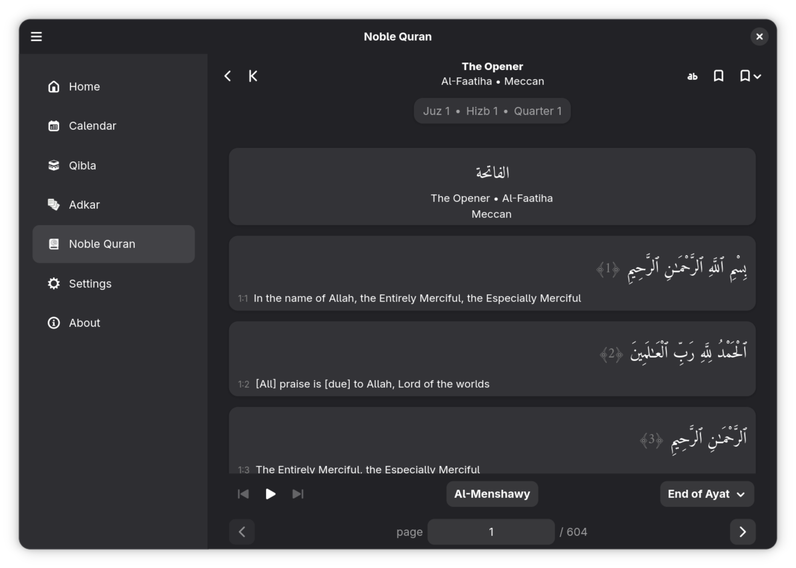
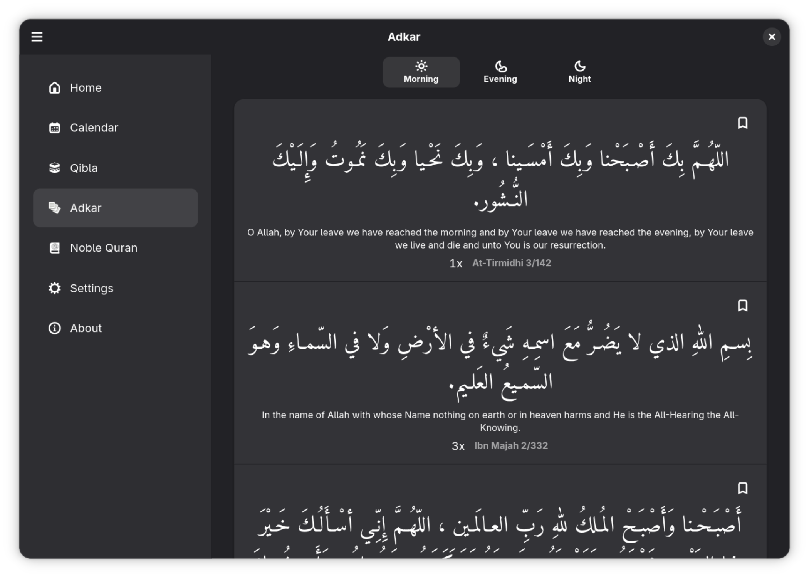
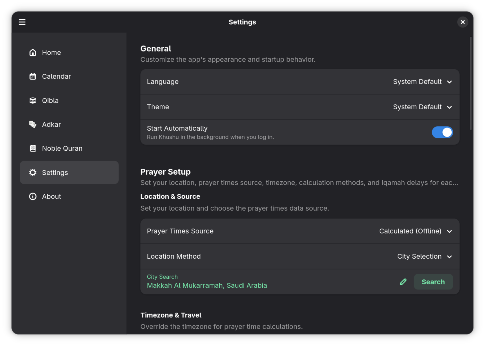
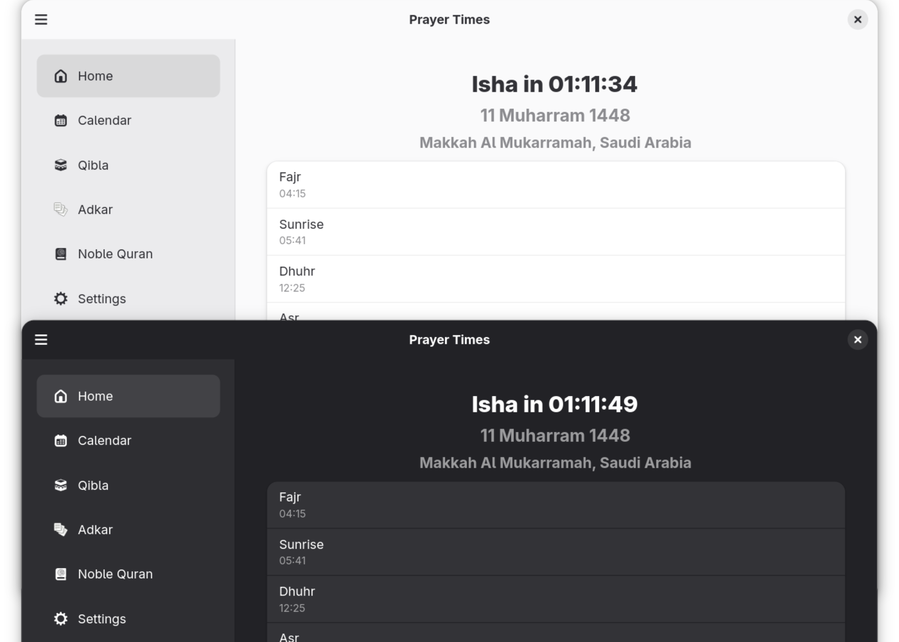

<div align="center">

  
  <h1>Khushu (خشوع)</h1>

  [](https://www.rust-lang.org/)
  [](https://gtk.org/)
  [](https://gnome.pages.gitlab.gnome.org/libadwaita/)
  [](#)
  [](LICENSE)
  [](#)

</div>

**Khushu is your all-in-one Muslim app for Linux desktop, tablets, and smartphones.**

Named after the state of heart-presence and humility in prayer (Salah), the app is designed to help you disconnect from digital noise and reconnect with your Creator. It brings together accurate prayer times, native Adkar notifications, and a dedicated Noble Quran reader with ayah-by-ayah recitation in a clean, modern interface—built with zero telemetry and total respect for your data.

## Screenshots

<div align="center">
<table>
  <tr>
    <td align="center"><br/><sub>Welcome & Setup</sub></td>
    <td align="center"><br/><sub>Prayer Times Dashboard</sub></td>
  </tr>
  <tr>
    <td align="center"><br/><sub>Hijri Calendar</sub></td>
    <td align="center"><br/><sub>Qibla Compass</sub></td>
  </tr>
  <tr>
    <td align="center"><br/><sub>Noble Quran</sub></td>
    <td align="center"><br/><sub>Adkar</sub></td>
  </tr>
  <tr>
    <td align="center"><br/><sub>Settings</sub></td>
    <td align="center"><br/><sub>Dynamic Theming</sub></td>
  </tr>
</table>
</div>

## Features

- **Accurate Prayer (Salah) Times**: Offline calculations with standard methods (MWL, ISNA, Egypt, etc.) plus recommended high-latitude and polar estimation methods.
- **Privacy-First Location**:
    - **Manual**: Enter coordinates manually (Zero network usage).
    - **City Search**: Search via OpenStreetMap (Minimal data).
    - **Auto**: System location via GeoClue (no IP-based lookup; data stays on device).
- **Adhan & Notifications**:
    - Play Adhan sound at prayer times.
    - **Audio Presets**: Select from bundled sounds or use your own custom MP3.
    - **Pre-Prayer Alerts**: Get notified before the prayer starts.
    - **System Integration**: Native desktop notifications.
- **Noble Quran**: Read the Quran and listen to ayah-by-ayah recitation with selectable reciters, adjustable Arabic and translation typography, line spacing, and a clean reading layout.
- **Adkar**: Built-in Morning and Evening Adkar module.
- **Hijri Calendar**: Current Hijri date displayed on dashboard.
- **Secure Configuration**: Your sensitive settings (like latitude/longitude) are stored locally with restricted file permissions.
- **Modern UI**: Native Libadwaita interface with adaptive dark mode and system tray integration.

## What's Next? (Roadmap)

Khushu is under active development. Our goal is to build the premier all-in-one Islamic ecosystem for Linux.

- [x] **v1.0.0 — Prayer Times & Daily Worship**: Accurate prayer times with multiple calculation methods, Adhan audio notifications, staggered Adkar (morning/evening/night), interactive Qibla compass, Hijri calendar, and full multi-language support (Arabic, English, French, Spanish, Turkish).
- [x] **v1.1.0 — Noble Quran Reader**: Fully offline Quran with Uthmanic Arabic script (Amiri Quran font), parallel translations in five languages, mushaf-style page navigation, diacritic-aware full-text search, bookmarks, reading-position memory, and adjustable typography.
- [x] **v1.2.0 — Noble Quran Recitation**: Ayah-by-ayah audio playback with selectable reciters, real-time verse highlighting, and auto-scroll.
- [x] **v1.3.0 — High-Latitude Support**: Migrated prayer time library from salah to mawaqit, added `LocalRelativeEstimation` rule for high-latitude zones (48.6°–66.5°) and `NearestLatitude` polar fallback (>66.5°), ensuring accurate prayer times at extreme latitudes.
- [ ] **Tafsir (v1.4.0)**: We are working on an in-depth Quran commentary experience with classical and modern exegeses including Al-Muyassar, Ibn Kathir, Tabari, Qurtubi, and Al-Saddi, fetched per-surah with offline caching.
- [ ] **Islamic Essentials (v1.5.0)**: We are working on a few more tools, including a simple Zakat calculator, a way to reflect on the 99 Names of Allah, and a collection of the Forty Hadith of Nawawi.
- [ ] **Beyond the Desktop (v2.0.0)**: We want Khushu to be wherever you are. This means perfecting the experience for Linux mobile (Phosh/Plasma) and exploring an Android version by leveraging the same core logic we already built.

## Installation

### Recommended Methods

<p align="center">
  <a href="https://flathub.org/apps/io.github.sniper1720.khushu">
    
  </a>
</p>

| Format | Command |
| :--- | :--- |
| **Flatpak (Flathub)** | `flatpak install flathub io.github.sniper1720.khushu` |
| **Snap (Snap Store)** | `sudo snap install khushu` |
| **Arch Linux (AUR)** | `yay -S khushu` *(compiles from source)* or `yay -S khushu-bin` *(prebuilt, no compilation needed)* |

#### Testing Flatpak Builds Locally

To build and test Flatpak packages locally:

```bash
# Build the Flatpak from local manifest
flatpak-builder --user --install build-dir packaging/flatpak/io.github.sniper1720.khushu.yml

# Run the installed Flatpak
flatpak run io.github.sniper1720.khushu

# Or build a bundle for testing
flatpak-builder --force-clean --bundle-filters=runtime packaging/flatpak/io.github.sniper1720.khushu.yml khushu.flatpak
flatpak install --user khushu.flatpak
```

To validate the Flatpak manifest:
```bash
flatpak run --command=flatpak-builder-lint org.flatpak.Builder manifest packaging/flatpak/io.github.sniper1720.khushu.yml
```

### Binary Packages
Pre-compiled **.deb** and **.rpm** binaries are available on the [GitHub Releases](https://github.com/sniper1720/khushu/releases) page for manual installation on Debian, Ubuntu, Fedora, and openSUSE.

---

### Build from Source

If you prefer to compile Khushu manually, you must first install the required system dependencies and the Rust toolchain.

#### 1. System Dependencies

| Distribution | Installation Command |
| :--- | :--- |
| **Debian / Ubuntu** | `sudo apt install libgtk-4-dev libadwaita-1-dev libasound2-dev libssl-dev build-essential pkg-config gettext` |
| **Fedora** | `sudo dnf install gtk4-devel libadwaita-devel alsa-lib-devel openssl-devel gcc pkgconf-pkg-config gettext` |
| **Arch Linux** | `sudo pacman -S gtk4 libadwaita alsa-lib openssl base-devel gettext` |
| **openSUSE** | `sudo zypper install gtk4-devel libadwaita-devel alsa-lib-devel openssl-devel gcc pkg-config gettext` |

#### 2. Rust Toolchain
Install the latest stable Rust toolchain (2024 Edition support required):
```bash
curl --proto '=https' --tlsv1.2 -sSf https://sh.rustup.rs | sh
```
*Note: After installation, restart your terminal or run `source $HOME/.cargo/env`.*

#### 3. Compile and Run
```bash
git clone https://github.com/sniper1720/khushu.git
cd khushu
cargo run --release
```

## Configuration

Khushu stores its configuration in a localized JSON file at `~/.config/khushu/config.json`. This file manages all your personal preferences, including:

- **Location Settings**: Whether you use manual coordinates, city search, or auto-detection.
- **Prayer Calculation**: Your preferred calculation method, madhab (Asr shadow factor), and custom offsets.
- **Notifications**: Adhan sound selections, pre-prayer alert timings, and Adkar notification toggles.
- **Volume & Audio**: Output device settings and volume levels for both Adhan and Adkar alerts.

For your privacy, sensitive fields such as your latitude and longitude are stored in a file with restricted permissions (`0o600`, readable only by your user) at `~/.config/khushu/config.json`. While you can modify this file manually, it is recommended to use the built-in **Settings** menu within the application to ensure all changes are validated and correctly saved.

## Privacy & Data Use

Khushu is designed with privacy as a core principle. Here is exactly what data leaves your device and when:

| Service | When Used | Data Sent | Purpose |
|---------|-----------|-----------|---------|
| **GeoClue** (D-Bus) | "Auto" location mode only | None — queries the system location service locally | Obtains GPS/network-based coordinates without any external request |
| **OpenStreetMap Nominatim** | "City Search" and "Auto" modes | City name or coordinates | Resolves city names to coordinates (City Search) or coordinates to city names (Auto reverse geocode); subject to [OSM privacy policy](https://wiki.osmfoundation.org/wiki/Privacy_Policy) |
| **None** | "Manual" mode | Nothing | You enter coordinates yourself — zero network traffic |

**Local storage:** Your latitude and longitude never leave your device in **Manual** and **City Search** modes. Only **Auto** mode sends them, to OpenStreetMap Nominatim for reverse geocoding.

**No analytics, no telemetry, no accounts.** All prayer calculations, Adkar, Hijri dates, and Qibla bearing are computed locally on your device.

## Data Sources

Khushu embeds two content modules that rely on third-party sources: the Noble Quran and the Adkar (Hisn al-Muslim).

### Noble Quran

The Noble Quran module in Khushu uses the following sources for its Arabic text and translations:

- **Uthmani Quran Text**: Sourced from [Tanzil.net](https://tanzil.net).
- **English Transliteration**: Sourced from [Tanzil.net](https://tanzil.net).
- **English Translation**: Authored by Umm Muhammad (Saheeh International), sourced from [Tanzil.net](https://tanzil.net).
- **Spanish Translation**: Authored by Muhammad Isa García, sourced from [Tanzil.net](https://tanzil.net).
- **French Translation**: Authored by Muhammad Hamidullah, sourced from [Tanzil.net](https://tanzil.net).
- **Indonesian Translation**: Authored by the Indonesian Islamic Affairs Ministry, sourced from [The Noble Qur'an Encyclopedia](https://quranenc.com).
- **Turkish Translation**: Authored by the Turkish Directorate of Religious Affairs, sourced from [Tanzil.net](https://tanzil.net).
- **Quran Recitation Audio**: Sourced from [VerseByVerse Quran](https://www.versebyversequran.com/).

> [!NOTE]
> No translation of Quran can be a hundred percent accurate, nor it can be used as a replacement of the Quran text. We got Quran translations from [Tanzil.net](https://tanzil.net) and [QuranEnc.com](https://quranenc.com) websites, we cannot guarantee their authenticity and/or accuracy. Please use them at your own discretion.

### Adkar (Hisn al-Muslim)

The Adkar module in Khushu uses the following sources for its Arabic text and translations:

- **Arabic Text (Hisn al-Muslim)**: Authored by Shaykh Sa'id bin Ali bin Wahf al-Qahtani, sourced from [Sunnah.com](https://sunnah.com/hisn) and [IslamHouse (Arabic)](https://islamhouse.com/ar/books/2522).
- **English Translation**: *Fortress of the Muslim — Du'a from the Qur'an & Sunnah*, published by Darussalam Publishers, Riyadh, sourced from [Sunnah.com](https://sunnah.com/hisn) and [Kalamullah.com](https://www.kalamullah.com/Books/fortress_of_the_muslim.pdf).
- **French Translation**: *La Citadelle du Musulman*, supervised translation by Shaykh Sa'id bin Ali bin Wahf al-Qahtani, published by Albouraq (Ennour), sourced from [IslamHouse (French)](https://islamhouse.com/fr/books/1566) and its [PDF](https://d1.islamhouse.com/data/fr/ih_books/single/fr_Fortress_of_the_Muslim.pdf).
- **Spanish Translation**: *La Fortaleza del Musulmán, súplicas del Corán y la Sunnah*, translated by Muhammad Isa García, published by Oficina de Dawa en Rabwah, Riyadh (2006), sourced from [IslamHouse](https://islamhouse.com/es/books/1081) and its [PDF](https://d1.islamhouse.com/data/es/ih_books/single/es_Muslim_bastion.pdf).
- **Indonesian Translation**: *Hisnul Muslim* (Benteng Orang Muslim), sourced from [IslamHouse](https://id.islamhouse.com) and [HisnulMuslim.org](https://hisnulmuslim.org/hisnul-muslim/indonesian/).
- **Turkish Translation**: *Hisnü'l-Müslim — Kur'an ve Sünnetten Müslümanın Sığınağı*, published by IslamHouse TR, sourced from [IslamHouse (Turkish)](https://islamhouse.com/tr/books/861) and its [PDF](https://d1.islamhouse.com/data/tr/ih_books/single/tr_Hisnul_Muslim.pdf).

> [!NOTE]
> The Adkar texts were transcribed from the published editions listed above and carefully checked against their authentic sources — the Arabic against the original Hisn al-Muslim with its hadith references, and each translation against its printed edition. Despite this care, an error can still slip through, especially in translations. If you notice any wording that differs from the published editions, please report it so we can fix it.

## Contribute & Support

- **Star the Repository** — It helps more people find the project!
- **Report Bugs** — Found an issue? [Open a ticket](https://github.com/sniper1720/khushu/issues) on GitHub.
- **Suggest Features** — Have a cool idea? Let me know!
- **Share** — Tell your friends!

> *Ibn Mas'ud (RAA) narrated that the Messenger of Allah (ﷺ) said:*
> *"He who guides (others) to an act of goodness, will have a reward similar to that of its doer."*
> *— Related by Muslim*

## License

This project is licensed under the **GNU General Public License v3.0 or later**. See [LICENSE](LICENSE) for details.
